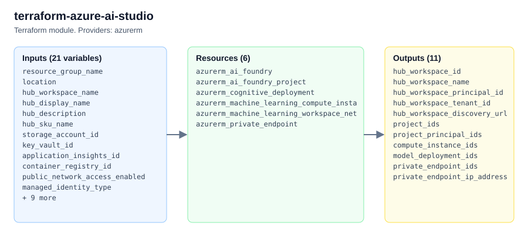

# terraform-azure-ai-studio

Production-ready Terraform module for deploying Azure AI Studio with hub workspaces, projects, model deployments, compute instances, service connections, and private endpoints.

## Architecture



```mermaid
flowchart TB
    subgraph Hub["Azure AI Hub Workspace"]
        HW[AI Hub Workspace]
        MI[Managed Identity]
    end

    subgraph Projects["AI Studio Projects"]
        P1[Project - NLP]
        P2[Project - Vision]
        P3[Project - Agents]
    end

    subgraph Compute["Compute Resources"]
        CI1[Compute Instance 1]
        CI2[Compute Instance 2]
    end

    subgraph Models["Model Deployments"]
        MD1[GPT-4o]
        MD2[Embeddings Model]
    end

    subgraph Storage["Backing Services"]
        SA[Storage Account]
        KV[Key Vault]
        AI[Application Insights]
        CR[Container Registry]
    end

    subgraph Network["Network Security"]
        PE[Private Endpoints]
        DNS[Private DNS Zones]
        VNET[Virtual Network]
    end

    subgraph External["External Services"]
        OAI[Azure OpenAI]
        COG[Cognitive Services]
    end

    HW --> P1
    HW --> P2
    HW --> P3
    HW --> CI1
    HW --> CI2
    HW --> MI
    HW --> SA
    HW --> KV
    HW --> AI
    HW --> CR
    MD1 --> OAI
    MD2 --> OAI
    HW --> OAI
    HW --> COG
    PE --> HW
    PE --> DNS
    PE --> VNET

    style HW fill:#0078D4,stroke:#005A9E,color:#fff
    style MI fill:#0078D4,stroke:#005A9E,color:#fff
    style P1 fill:#8C4FFF,stroke:#6B3AC2,color:#fff
    style P2 fill:#8C4FFF,stroke:#6B3AC2,color:#fff
    style P3 fill:#8C4FFF,stroke:#6B3AC2,color:#fff
    style CI1 fill:#FF9900,stroke:#CC7A00,color:#fff
    style CI2 fill:#FF9900,stroke:#CC7A00,color:#fff
    style MD1 fill:#3F8624,stroke:#2D6119,color:#fff
    style MD2 fill:#3F8624,stroke:#2D6119,color:#fff
    style SA fill:#0078D4,stroke:#005A9E,color:#fff
    style KV fill:#0078D4,stroke:#005A9E,color:#fff
    style AI fill:#0078D4,stroke:#005A9E,color:#fff
    style CR fill:#0078D4,stroke:#005A9E,color:#fff
    style PE fill:#DD344C,stroke:#B02A3E,color:#fff
    style DNS fill:#DD344C,stroke:#B02A3E,color:#fff
    style VNET fill:#DD344C,stroke:#B02A3E,color:#fff
    style OAI fill:#3F8624,stroke:#2D6119,color:#fff
    style COG fill:#3F8624,stroke:#2D6119,color:#fff
```

## Usage

```hcl
module "ai_studio" {
  source = "path/to/terraform-azure-ai-studio"

  resource_group_name = "rg-ai-studio"
  location            = "East US"
  hub_workspace_name  = "hub-prod-001"
  storage_account_id  = azurerm_storage_account.this.id
  key_vault_id        = azurerm_key_vault.this.id

  projects = {
    "project-nlp" = {
      display_name = "NLP Research"
      description  = "Natural Language Processing"
    }
  }

  tags = {
    Environment = "production"
  }
}
```

## Examples

- [Basic](examples/basic/main.tf) - Minimal hub workspace deployment
- [Advanced](examples/advanced/main.tf) - Hub with projects, compute, and model deployments
- [Complete](examples/complete/main.tf) - Full deployment with private endpoints, user-assigned identity, and all features

## Requirements

| Name | Version |
|------|---------|
| [terraform](https://www.terraform.io/) | >= 1.5.0 |
| [azurerm](https://registry.terraform.io/providers/hashicorp/azurerm/latest/docs) | >= 5.0.0, < 6.0.0 |

## Resources

| Name | Type | Documentation |
|------|------|---------------|
| [azurerm_ai_foundry](https://registry.terraform.io/providers/hashicorp/azurerm/latest/docs/resources/ai_foundry) | resource | AI Studio hub |
| [azurerm_ai_foundry_project](https://registry.terraform.io/providers/hashicorp/azurerm/latest/docs/resources/ai_foundry_project) | resource | AI Studio projects |
| [azurerm_machine_learning_compute_instance](https://registry.terraform.io/providers/hashicorp/azurerm/latest/docs/resources/machine_learning_compute_instance) | resource | Compute instances |
| [azurerm_cognitive_deployment](https://registry.terraform.io/providers/hashicorp/azurerm/latest/docs/resources/cognitive_deployment) | resource | Model deployments |
| [azurerm_private_endpoint](https://registry.terraform.io/providers/hashicorp/azurerm/latest/docs/resources/private_endpoint) | resource | Private endpoints |
| [azurerm_resource_group](https://registry.terraform.io/providers/hashicorp/azurerm/latest/docs/data-sources/resource_group) | data source | Resource group lookup |
| [azurerm_client_config](https://registry.terraform.io/providers/hashicorp/azurerm/latest/docs/data-sources/client_config) | data source | Current client config |

## Inputs

| Name | Description | Type | Default | Required |
|------|-------------|------|---------|----------|
| resource_group_name | Name of the resource group | `string` | n/a | yes |
| location | Azure region for all resources | `string` | n/a | yes |
| hub_workspace_name | Name of the Azure AI Hub workspace | `string` | n/a | yes |
| hub_display_name | Display name for the AI Hub | `string` | `""` | no |
| hub_description | Description for the AI Hub | `string` | `"Azure AI Hub Workspace"` | no |
| hub_sku_name | Deprecated, ignored (azurerm_ai_foundry has no SKU) | `string` | `"Basic"` | no |
| storage_account_id | Resource ID of the Storage Account | `string` | n/a | yes |
| key_vault_id | Resource ID of the Key Vault | `string` | n/a | yes |
| application_insights_id | Resource ID of Application Insights | `string` | `null` | no |
| container_registry_id | Resource ID of Container Registry | `string` | `null` | no |
| public_network_access_enabled | Enable public network access | `bool` | `true` | no |
| managed_identity_type | Managed identity type | `string` | `"SystemAssigned"` | no |
| user_assigned_identity_ids | User-assigned identity IDs | `list(string)` | `[]` | no |
| projects | Map of projects to create | `map(object)` | `{}` | no |
| compute_instances | Map of compute instances | `map(object)` | `{}` | no |
| model_deployments | Map of model deployments | `map(object)` | `{}` | no |
| connections | Map of service connections | `map(object)` | `{}` | no |
| private_endpoints | Map of private endpoints | `map(object)` | `{}` | no |
| encryption | CMK encryption configuration | `object` | `null` | no |
| tags | Tags to apply to all resources | `map(string)` | `{}` | no |

## Outputs

| Name | Description |
|------|-------------|
| hub_workspace_id | Resource ID of the AI Hub workspace |
| hub_workspace_name | Name of the AI Hub workspace |
| hub_workspace_principal_id | Principal ID of the hub managed identity |
| hub_workspace_tenant_id | Tenant ID of the hub managed identity |
| hub_workspace_discovery_url | Discovery URL of the AI Hub workspace |
| project_ids | Map of project names to resource IDs |
| project_principal_ids | Map of project names to identity principal IDs |
| compute_instance_ids | Map of compute instance names to resource IDs |
| model_deployment_ids | Map of model deployment names to resource IDs |
| private_endpoint_ids | Map of private endpoint names to resource IDs |
| private_endpoint_ip_addresses | Map of private endpoint names to private IPs |

## License

MIT License - see [LICENSE](LICENSE) for details.

<!-- project-structure -->
## Project structure

```text
├── .github/
├── docs/
│   └── architecture.html
├── examples/
│   ├── advanced/
│   ├── basic/
│   └── complete/
├── tests/
│   ├── main.tf
│   ├── outputs.tf
│   └── providers.tf
├── .editorconfig
├── .gitattributes
├── .gitignore
├── CHANGELOG.md
├── CODEOWNERS
├── CONTRIBUTING.md
├── LICENSE
├── README.md
├── SECURITY.md
├── main.tf
├── outputs.tf
├── variables.tf
└── versions.tf
```

<!-- architecture -->
## Architecture


